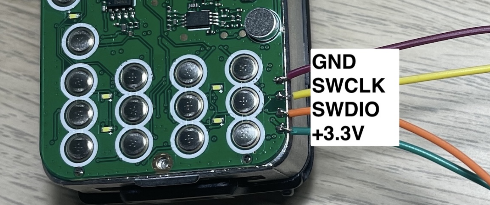

## Setup

### UV-K5's SWD Interface

On the front side of the PCB, there are 4 TPs (test points) along the right edge near 
the keypad. They are the SWD interface we are looking for. From top to bottom: 

- 1: GND
- 2: PB14 / SWCLK
- 3: PB11 / SWDIO
- 4: 3V3




### FT4232HL Debug Adapter

I am using an FT4232HL board as swd debugging adapter. The silk screen on the PCB reads "FT4232HL Board V3". 

Only the 1st 2 out of the total 4 ports (Port A & B) can be used for debugging. According 
to the schematic of the FT**2**232 V3 board from the same supplier, there is a 820 ohm resistor, 
which can be enabled or disabled by a jumper, between Pin D1 & D2 for each of the two debugging ports. 

For swd debugging use, the resistor should be enabled. Ref to openocd script `interface/ftdi/swd-resistor-hack.cfg` 

The wiring to target MCU: 

- GND - GND
- D0 (TCK) - SWCLK
- D1 (TDI) - connect to D2 through resistor
- D2 (TDO) - SWDIO

For interface configuration, ref to `interface/ftdi/minimodule-swd.cfg`. I'm gonna use channel 0 (channel A).


### USB Access Permission


Copy udev rules file from openocd distribution and apply

```sh
sudo cp openocd/contrib/60-openocd.rules /etc/udev/rules.d/
sudo udevadm control --reload
```

**Need to reconnect the adapter to take effect.**


### DP32G030 Target

We can simply use stm32f0x config script (`source [find target/stm32f0x.cfg]`) to connect to target. 
However there are a few tweaks need to make.

CPU freq on reset is 24 MHz, which is sufficiently high. Therefore there is no need to boost clock in the script.
SWD clock freq will be set to (24 MHz / 6) = 4000 KHz

Dp32g030 has a different flash base address (0x0) than that of stm32f0x (0x0800 0000). 
Also we cannot probe flash using stm32 driver: 

```
> flash probe 0
device id = 0x20003ff0
Cannot identify target as a STM32 family.
```

So we have to specify flash size explicitly. Dp32g030 has 64 KB of flash. 

Since UV-K5 does not expose a system reset signal, we have to configure soft reset.
Note that this is board-specific (rather than target-specific): 

```
cortex_m reset_config sysresetreq
```


### Launch Debugging

**For successful connection to it, we have to boot up UV-K5 into firmware flashing mode** 
(pressing PTT + power on). 
It's reasonable to presume that the firmware re-uses the SWD pins while the bootloader does not.

To launch openocd, run

```sh
openocd -f k5.cfg
```

If output of openocd looks like below, then we're fine to go: 

```
xPack Open On-Chip Debugger 0.12.0+dev-01850-geb6f2745b-dirty (2025-02-07-10:08)
Licensed under GNU GPL v2
For bug reports, read
        http://openocd.org/doc/doxygen/bugs.html
Info : FTDI SWD mode enabled
srst_only separate srst_nogate srst_open_drain connect_deassert_srst
Info : Listening on port 6666 for tcl connections
Info : Listening on port 4444 for telnet connections
Info : clock speed 1000 kHz
Info : SWD DPIDR 0x0bb11477
Info : [dp32g030.cpu] Cortex-M0 r0p0 processor detected
Info : [dp32g030.cpu] target has 4 breakpoints, 2 watchpoints
Info : [dp32g030.cpu] Examination succeed
Info : [dp32g030.cpu] starting gdb server on 3333
Info : Listening on port 3333 for gdb connections
```


One of the primary facilities Openocd provides us to examine the target (MCU) is the telnet console. 
To access the telnet console, run

```sh
telnet 127.0.0.1 4444
```

Most of the time before we look into the target we have to halt it: 

```
> targets
    TargetName         Type       Endian TapName            State       
--  ------------------ ---------- ------ ------------------ ------------
 0* dp32g030.cpu       cortex_m   little dp32g030.cpu       running
> 
> halt 
[dp32g030.cpu] halted due to debug-request, current mode: Thread 
xPSR: 0x21000000 pc: 0x00000426 msp: 0x200015c0
> 
> reset halt
[dp32g030.cpu] halted due to debug-request, current mode: Thread 
xPSR: 0x21000000 pc: 0x00000426 msp: 0x200015c0
> 
> targets
    TargetName         Type       Endian TapName            State       
--  ------------------ ---------- ------ ------------------ ------------
 0* dp32g030.cpu       cortex_m   little dp32g030.cpu       halted
>
> reg
===== arm v7m registers
(0) r0 (/32): 0x0001de22
(1) r1 (/32): 0x00000000
(2) r2 (/32): 0x00000000
(3) r3 (/32): 0xbadcffff
(4) r4 (/32): 0x40061000
(5) r5 (/32): 0x200003b4
(6) r6 (/32): 0x000186a0
 ...
```


## Tinkering!

### Dump Image

To dump the whole flash: 

```
> dump_image dump_k5_egzumer022_full.bin 0 0x10000
dumped 65536 bytes in 0.501543s (127.606 KiB/s)
```

I found that to successfully dump flash image, the speed of swd should be a little slower, 
for example at 4000 KHz it will fail, and 2000 KHz be OK

```
> adapter speed 2000
adapter speed: 2000 kHz
> dump_image dump.bin 0 0x10000
dumped 65536 bytes in 0.501390s (127.645 KiB/s)
> adapter speed 4000
adapter speed: 4000 kHz
```


### Flash Masking

Effectively the FLASH_MASK register (0x4006f020) "moves" the base address of flash reading 
by a mount of offset. 

When mask is disabled: 

```
> mdw 0x4006f020
0x4006f020: 00000000 
> mdw 0
0x00000000: 200015d8 
> mdw 4
0x00000004: 000000d5 
> mdw 0x2000
0x00002000: 73633801 
> mdw 0x2004
0x00002004: bd1038ff 
```

When masking is enabled (8 KB, offset = 0x2000): 

```
> mww 0x4006f020 0
> mww 0x4006f020 3
> mdw 0           
0x00000000: 73633801 
> mdw 4           
0x00000004: bd1038ff 
```

Set a watch point at the reg and watch what will happen: 

```
> reset init
[dp32g030.cpu] halted due to breakpoint, current mode: Thread 
xPSR: 0xc1000000 pc: 0x000000d4 msp: 0x200015d8
> 
> mdw 0x4006f020
0x4006f020: 00000004 
> 
> wp 0x4006f020 4 w
> wp
address: 0x4006f020, len: 0x00000004, r/w/a: w, value: 0x00000000, mask: 0xffffffffffffffff
> 
> resume
[dp32g030.cpu] halted due to watchpoint, current mode: Thread 
xPSR: 0x61000000 pc: 0x20000006 msp: 0x200015c0
> mdw 0x4006f020   
0x4006f020: 00000000 
> 
> resume
[dp32g030.cpu] halted due to watchpoint, current mode: Thread 
xPSR: 0x21000000 pc: 0x2000000a msp: 0x200015c0
> mdw 0x4006f020
0x4006f020: 00000002 
> 
> resume
[dp32g030.cpu] halted due to watchpoint, current mode: Thread 
xPSR: 0x21000000 pc: 0x2000000e msp: 0x200015c0
> mdw 0x4006f020
0x4006f020: 00000006 
> 
> resume
[dp32g030.cpu] Polling failed, trying to reexamine
Error connecting DP: cannot read IDR
[dp32g030.cpu] Examination failed
[dp32g030.cpu] Examination failed, GDB will be halted. Polling again in 100ms
...
```

As expected after reset the reg value is 0x4 (locked and no mask), which is its default reset value. 
Then a 4 KB mask is applied (reg value = 0x6). 

I guess the bootloader masks itself out before branching to firmware. If that's true, 
the bootloader is 4 KB in size.

Cortex-m0 cpu, not like cortex-m0+ for example, does not have a VTOR reg to support vector table relocation.
In that sense flash masking is dp32g030's VTOR equivalence.

